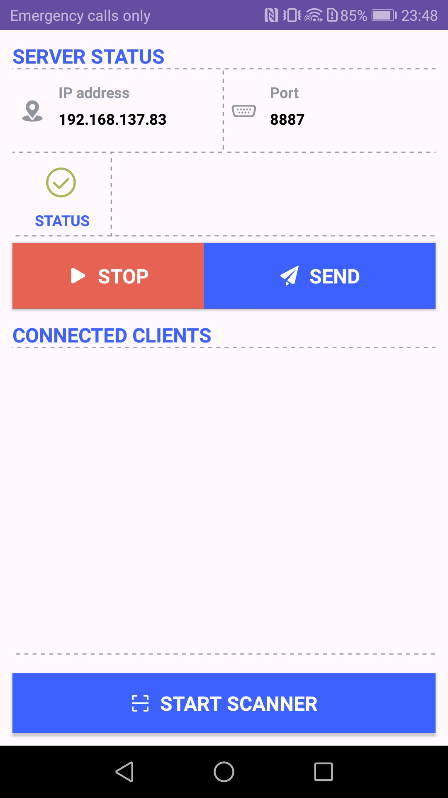
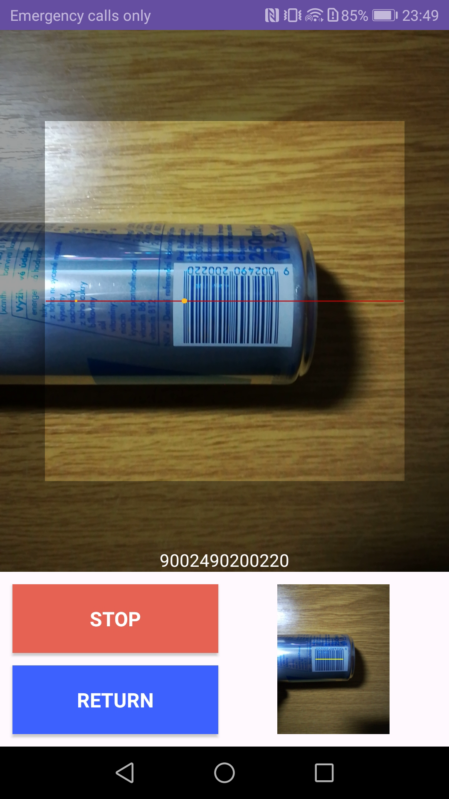
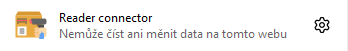
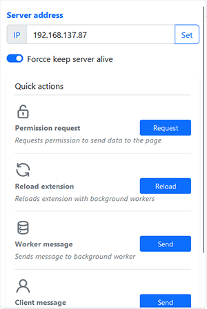
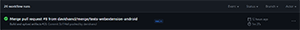
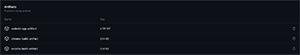

<h1 align="center">READER CONNECTOR</h1>
```diff ! BETA ```
<p align="center">
  <i>Web extension allows connection from a mobile app and use as a barcode scanner for the browser</i>
</p>
<div align="center">
  <a href="https://github.com/davidvancl/reader-connector/stargazers">
    
  </a>
  <a href="https://github.com/davidvancl/reader-connector/network/members">
    
  </a>
  <a href="https://github.com/davidvancl/reader-connector/pulls">
    
  </a>
  <a href="https://github.com/davidvancl/reader-connector/issues">
    
  </a>
  <a href="https://github.com/davidvancl/reader-connector/graphs/contributors">
    
  </a>
  <a href="https://github.com/davidvancl/reader-connector/blob/main/LICENCE">
    
  </a>
</div>
<br>
<p align="center">
  <i>For more interesting projects check out my <a href="https://github.com/davidvancl">Profile</a>
  </i>
</p>
<br>

> **Warning**  
> Tested only the connection between the Android app and the web extension on the local network

## Contents

- [Android application](#android-application)
- [Web extentsion (webextension-polyfill)](#web-extension)
- [ Builds, releases and others](#tech-info)
- [Getting Started](#getting-started)

## :green_apple: Android application ( > 8.0.0 )

The application is written in the Java programming language and built using Gradle. <br>

> **Note**  
> The app is displayed on the Huawei P9 Lite. Responsibility should be fully supported. For any imperfections write [issue](https://github.com/davidvancl/reader-connector/issues)

The application consists of three parts:

1. [Main activity](ReaderAndroidApp/app/src/main/java/com/example/readerandroidapp/MainActivity.java) - Main application window with the option to start and stop the websocket server and send a test message.<br>
   
2. [BarcodeCaptureActivity](ReaderAndroidApp/app/src/main/java/com/example/readerandroidapp/BarcodeCaptureActivity.java) - Window with reader mode that automatically sends data to the web extension after reading the code.<br>
   
3. [WebSocketService](ReaderAndroidApp/app/src/main/java/com/example/readerandroidapp/WebSocketService.java) - Background service that keeps in touch with websocket clients and sends them messages (codes).

Note: Application uses the [ZXing](https://github.com/journeyapps/zxing-android-embedded) library to read barcodes (CODE128, EAN8, EAN13) and QR codes.

## :strawberry: Web extentsion (webextension-polyfill)

Extension consists of the following three parts:

- [x] [Popup - React](popup)
- [x] [Background worker](background)
- [x] [Content worker](conetnt)

### Popup - React

> **Note**  
> Some elements may not be visible depends on browser type

- Icon displayed in the browser <br>
  

- Window displayed when the extension is clicked <br>
  

### Background worker

Script running in the browser background. It maintains a connection with the websocket server (Android app) and listens for received messages, which it forwards to the page.

> **Note**
> The script behaves differently depending on the browser type. With Chrome it runs all the time, but in Mozilla you need to force it to maintain the connection

### Content worker

Script included in individual pages opened in the browser. Sets up interception of messages coming from background worker. If a message arrives from a websocket, it will automatically call (Signal.publish) with scanned code.

## :hammer: Builds, releases and others

<table>
<tbody>
    <tr>
        <td>Build Status</td>
        <td>
            
        </td>
    </tr>
    <tr>
        <td>Coverage</td>
        <td>
            
        </td>
    </tr>
    <tr>
        <td>Latest dev release</td>
        <td>
            
            
        </td>
    </tr>
    <tr>
        <td>Latest release</td>
        <td>
        
    </tr>
    <tr>
    <td>Docs</td>
        <td>
            
            
        </td>
    </tr>
    <tr>
        <td>Notebooks</td>
        <td>
            
        </td>
    </tr>
    <tr>
        <td>Support</td>
        <td>
            
            
        </td>
    </tr>
</tbody>
</table>

## :wrench: Getting Started

> **Warning**  
> The steps may be different due to different browsers or phones

> **Note**  
> The steps with downloading artifacts will be changed in the future to downloading from the extension store and the android app will be installed via Google Play

1. Download the artifact (extension and app) from the last workflow action (build). <br>
   1.1 Open [actions](https://github.com/davidvancl/reader-connector/actions) and select the first line you see. For example: <br>
    <br>
   1.2 At the bottom there is a section with artifacty download android app and extension <br>
    <br>
2. Installing a web extension <br>
   2.1 [Mozilla] Go to [url](about:debugging#/setup) -> choose "This Firefox" -> "Load Temporary Add-on..." -> select downloaded folder (unzipped). For more information click [here](https://support.mozilla.org/en-US/kb/find-and-install-add-ons-firefox-android). <br>
   2.2 [Chrome] Go to [url](chrome://extensions/) -> "Add extension" -> select downloaded folder (unzipped). For more information click [here](https://support.google.com/chromebook/answer/2588006?hl=en). <br>
3. Installing android app <br>
   3.1 It depends on the Android, but here's some [guidance on how to do it](https://www.lifewire.com/install-apk-on-android-4177185). <br>

Enjoy!

# :floppy_disk: Contribute

Contributions are always welcome! Please create a PR to add Github Profile.

## :pencil: License

This project is licensed under [MIT](https://opensource.org/licenses/MIT) license.

## :man_astronaut: Show your support

Give a ⭐️ if this project helped you!
