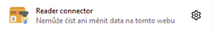

<h1 align="center">READER CONNECTOR</h1>

  <i>Web extension allows connection from a mobile app and use as a barcode scanner for the browser</i>

  
  
  
  
  
  

 

  <i>For more interesting projects check out my <a href="https://github.com/davidvancl">Profile</a>
  </i>

 

> **Warning**  
> Tested only the connection between the Android app and the web extension on the local network

## Contents

- [Android application](#android-application)
- [Web extentsion (webextension-polyfill)](#web-extension)
- [ Builds, releases and others](#tech-info)
- [Development setup](#dev-container-setup)
- [GitHub workflow and artifacts](#github-workflow-artifacts)

## :green_apple: Android application

## :strawberry: Web extentsion (webextension-polyfill)

- [ ] [Popup - React](popup)
- [ ] [Background worker](background)
- [ ] [Content worker](conetnt)
- [ ] [Webpack config](webpack)
- [ ] [Packages - npm, yarn](packages)

### Popup - React

> **Note**  
> Some elements may not be visible depends on browser type

## :hammer: Builds, releases and others

<table>
<tbody>
    <tr>
        <td>Build Status</td>
        <td>
            
        </td>
    </tr>
    <tr>
        <td>Coverage</td>
        <td>
            
        </td>
    </tr>
    <tr>
        <td>Latest dev release</td>
        <td>
            
            
        </td>
    </tr>
    <tr>
        <td>Latest release</td>
        <td>
        
    </tr>
    <tr>
    <td>Docs</td>
        <td>
            
            
        </td>
    </tr>
    <tr>
        <td>Notebooks</td>
        <td>
            
        </td>
    </tr>
    <tr>
        <td>Support</td>
        <td>
            
            
        </td>
    </tr>
</tbody>
</table>

## :wrench: Development setup

- [Profile Summary For Github](https://profile-summary-for-github.com/search)
- [Github Readme Stats](https://github.com/anuraghazra/github-readme-stats) - Dynamically generated stats for your github readmes

## :floppy_disk: GitHub workflow and artifacts

# Contribute

Contributions are always welcome! Please create a PR to add Github Profile.

## :pencil: License

This project is licensed under [MIT](https://opensource.org/licenses/MIT) license.

## :man_astronaut: Show your support

Give a ⭐️ if this project helped you!
